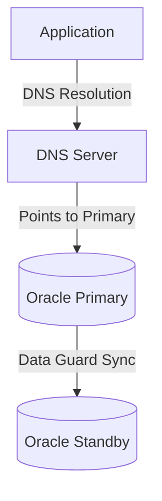

# Zero-Downtime Cross-Engine Database Migration PoC

This Proof of Concept demonstrates migrating from a traditional, DNS-bound Oracle-to-Oracle Data Guard setup to a modern, zero-downtime, active-passive cross-engine (Oracle-to-Postgres) cluster using a custom Smart JDBC Routing Library and Consul.

## The Narrative

### The "Before" State (Legacy DNS & Data Guard)
In the legacy architecture, application failover requires significant manual intervention and downtime.



**Pain Points:**
- **DNS Propagation:** DNS changes take time to propagate across all client caches.
- **Application Restart:** Apps often cache DNS resolutions (JVM defaults) or connection pools hold stale connections, requiring full app restarts.
- **Downtime:** The entire process can take 10-30+ minutes of complete unavailability.

### The "After" State (Smart Library, Consul, Postgres)
The new architecture introduces a Smart JDBC Router that dynamically shifts traffic based on Consul KV state, paired with an asynchronous CDC worker for cross-engine replication.

```mermaid
graph TD
    App[Applications with Smart JDBC Router] -->|Long Polling| Consul[Consul Cluster]
    App -->|Active: ORACLE| Oracle[(Oracle 19c)]
    App -->|Active: POSTGRES| PG[(PostgreSQL 16)]
    Oracle <-->|CDC Worker (Outbox)| PG
```

**Key Improvements:**
- **Zero-Downtime Switchover:** Incoming requests are "parked" during the switchover, draining transactions gracefully.
- **Dynamic Syntax Translation:** JSqlParser on the fly converts Oracle-isms (`NVL`, `DUAL`) to Postgres equivalents.
- **Cross-Engine CDC:** A custom Java worker manages bidirectional outbox replication without XA transactions.

## Setup & Infrastructure

### 1. Start the Stack
```bash
docker-compose up -d
```
This spins up:
- Oracle 19c (Primary)
- PostgreSQL 16 (Secondary)
- Dummy Oracle (Legacy Standby simulation)
- Consul Cluster (3 Nodes)
- Toxiproxy (Chaos engineering)
- Prometheus & Grafana (Observability)

### 2. Build the Project
```bash
mvn clean install
```

## Demo Scripts

### Demo 1: The "Before" State (The Pain of DNS)
Simulate the legacy failover process.

1. **Send Traffic:** Continuously curl the application endpoint.
   ```bash
   while true; do curl http://localhost:8081/legacy-query; sleep 1; done
   ```
2. **Simulate Outage:** Stop the primary database or app container.
   ```bash
   docker stop app1-websphere
   ```
3. **DNS Update & Wait:** In reality, this is updating DNS at the provider and waiting.
   ```bash
   # Simulate DNS update by editing /etc/hosts or docker networks
   echo "Simulating 10 minute wait for DNS TTL..."
   sleep 10
   ```
4. **Data Guard Switchover:** Start the standby database.
   ```bash
   docker start oracle-standby
   ```
5. **Restart App:** Bring the application back online.
   ```bash
   docker start app1-websphere
   ```

### Demo 2: The "After" State (Zero-Downtime Magic)

#### 1. Normal Operations
- Traffic flows to Apps 1 & 2.
- Routing points to Oracle (`curl http://localhost:8500/v1/kv/db/active` returns `ORACLE`).
- CDC Worker constantly replicates outbox records to Postgres.

#### 2. Graceful Switchover (Planned Outage)
- Change Consul KV state to drain to Postgres:
  ```bash
  curl --request PUT --data "DRAINING_TO_POSTGRES" http://localhost:8500/v1/kv/db/active
  ```
- **Observe:**
  - The Smart Library intercepts this state change via long-polling.
  - New connections are paused (parked via Java `LockSupport` or `CountDownLatch`).
  - Existing transactions commit.
  - CDC Worker drains the final Oracle outbox rows.
  - CDC Worker updates Consul KV to `POSTGRES`.
  - Apps automatically unpark and resume routing to Postgres.
  - No 500 errors returned to clients, only brief latency.

#### 3. Operations on Postgres (Dynamic Translation)
- Hit the App 1 endpoint executing `SELECT NVL(salary, 0) FROM DUAL`.
- **Observe:** The query succeeds. The Smart Library's JSqlParser interceptor rewrote it to `SELECT COALESCE(salary, 0)` under the hood!

#### 4. Violent Failover (Chaos)
- Use Toxiproxy to simulate a hard partition to Oracle:
  ```bash
  # Example toxiproxy cli command to cut off connection
  docker exec -it toxiproxy toxiproxy-cli config proxy update oracle --listen 0.0.0.0:1521 --upstream oracle-primary:1521 --down
  ```
- Consul health checks fail.
- Automatic reroute triggered to Postgres.
- Check Grafana to see the brief error spike before auto-recovery.

## Code Structure

- **smart-jdbc-library:** The core `AbstractRoutingDataSource` and `JSqlParser` translation logic.
- **cdc-worker:** Bidirectional replication logic using the Outbox pattern.
- **app1-websphere:** Spring App 1 (simulating Liberty) running raw `JdbcTemplate` queries.
- **app2-springboot:** Spring App 2 running JPA.
